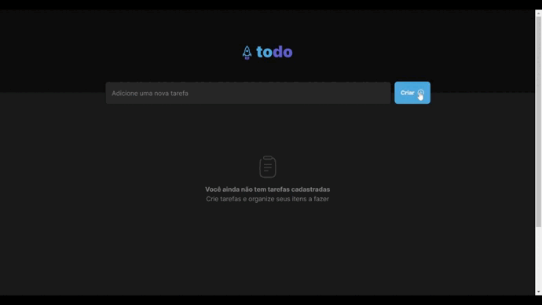

# To Do List - FullStack

<div display="flex">
  
  
  
  
  
  
  
   
   
  
  
  
</div>



Bem-vindo ao meu repositório de To Do List, meu primeiro projeto FullStack de uma lista de tarefas. Criei este projeto com o intuito de aprender mais sobre desenvolvimento FullStack, utilizando as tecnologias mais populares do mercado.

# Índice

- [Sobre o projeto](#sobre-o-projeto)
- [Hospedagem](#hospedagem)
- [Informações do projeto](#informações-do-projeto)
- [Autor](#autor)

# Sobre o projeto

- Este projeto foi desenvolvido com o intuito de aprender mais sobre desenvolvimento FullStack, utilizando as tecnologias mais populares do mercado.

# Deploy

- O frontend do projeto foi hospedado no Netlify e pode ser acessado aqui: [To Do List](https://luizfelipe9627-to-do-list-fullstack.netlify.app)
- O backend do projeto foi hospedado no Render e pode ser acessado aqui: [To Do List API](https://to-do-list-api-6u0s.onrender.com/)

# Funcionalidades

- [x] Adicionar tarefas
- [x] Editar tarefas
- [x] Deletar tarefas
- [x] Marcar tarefas como concluídas
- [x] Validação nos campos de formulário
- [x] Ordenação das tarefas por status
- [x] Paginação das tarefas quando houver mais de 10 tarefas
- [x] Confirmação de exclusão de tarefa

# Instalação e execução

1. Clone este repositório:
    ```bash
      git clone https://github.com/luizfelipe9627/todolist-fullstack.git
    ```

2. Acesse a pasta do projeto no terminal/cmd:
    ```bash
      cd todolist-fullstack
    ```

3. Acesse a pasta do frontend:
    ```bash
      cd frontend
    ```

4. Siga as instruções do README.md da pasta frontend para instalar e executar o frontend do projeto:

    - [Frontend](frontend/README.md)

5. Acesse a pasta do backend:
    ```bash
      cd backend
    ```

6. Siga as instruções do README.md da pasta backend para instalar e executar o backend do projeto:

    - [Backend](backend/README.md)

## Autor

<table>
  <tr>
    <td align="center">
      <a href="https://github.com/luizfelipe9627">
        <br>
        <sub>
          <b>Luiz Felipe Silva</b>
        </sub>
      </a>
    </td>
  </tr>
</table>
