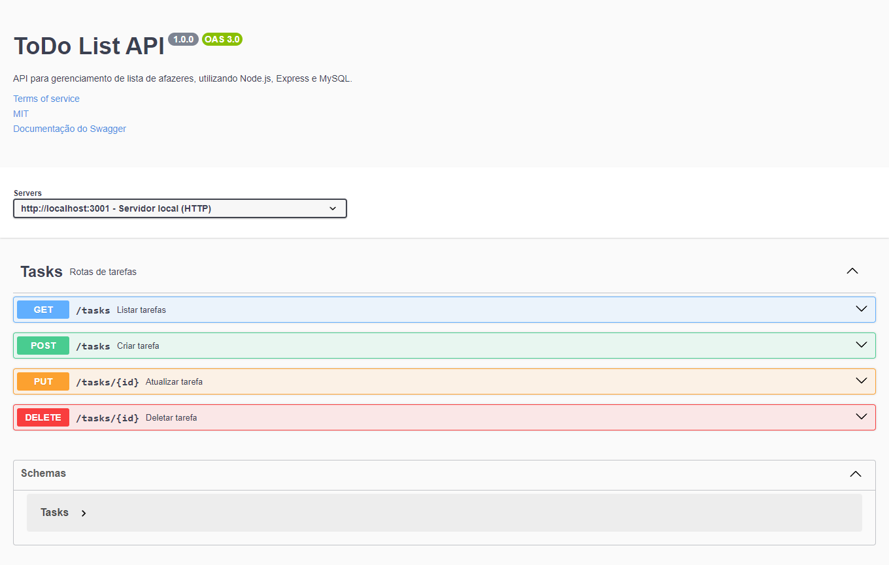

# Documentação da API

<div display="flex">
   
   
  
  
  
  
  
</div>



## Sumário

- [Introdução](#introdução)
- [Instalação](#instalação)
- [Variáveis de ambiente](#variáveis-de-ambiente)
- [MySQL em um servidor externo](#mysql-em-um-servidor-externo)
- [Visão geral da API](#visão-geral-da-api)
- [Documentação do Swagger](#documentação-do-swagger)
- [Recursos principais e Exemplos](#recursos-principais-e-exemplos)

## Introdução

Bem-vindo à documentação da API Tasks! Esta documentação fornece informações detalhadas sobre como usar a API, incluindo endpoints disponíveis, parâmetros aceitos, códigos de status e exemplos práticos. A documentação Swagger está disponível para uma visão mais interativa da API.

## Instalação

Para instalar e executar o projeto, siga os passos abaixo:

1. Clone o repositório
- Abra o terminal e execute o comando abaixo para clonar o repositório:

  ```bash
    git clone https://github.com/luizfelipe9627/todo-list-api.git
  ```

2. Acesse a pasta do projeto
- Navegue até a pasta do projeto com o comando abaixo:

  ```bash
    cd todo-list-api
  ```

3. Defina as variáveis de ambiente
- Siga as instruções do tópico [Variáveis de ambiente](#variáveis-de-ambiente) para definir as variáveis de ambiente no arquivo `.env`.

4. Instale o Docker
- Para instalar o Docker, siga as instruções no link abaixo:

  ```bash
    https://docs.docker.com/get-docker/
  ```

5. Inicie as Imagens do Docker

- Caso deseje rodar apenas o Node.JS, execute o comando abaixo:

Para criar a imagem do Node.JS e iniciar o container:
  ```bash
    npm run docker:app
  ```

- Caso deseje rodar junto com o MySQL, execute o comando abaixo:

Para criar a imagem do MySQL e iniciar o container:
  ```bash
    npm run docker:db
  ```

Obs.: Se deseja alterar o Schema do banco de dados, acesse o arquivo `src/database/schema.sql`, faça as alterações necessárias e execute o comando abaixo para atualizar o Schema do banco de dados:

  ```bash
    npm run docker:db:schema
  ```

6. Acesse o servidor local
- Acesse no terminal do editor de código ou no do Docker o link do servidor local, sendo a porta definida no arquivo `.env`:

  ```bash
    http://localhost:3000
  ```

## Variáveis de ambiente

- Caso deseje rodar o projeto em ambiente de desenvolvimento, copie o arquivo `.env.dev.example` e renomeie para `.env`. Os valores padrões não podem ser alterados, pois são necessários para o funcionamento correto do Docker com o MySQL.

  ```bash
    PORT=3001 # Para que o swagger funcione corretamente, a porta deve ser a deinida por padrão.
    NODE_ENV=development # Para rodar com o nodemon, o valor dessa variável deve ser 'development'.
    MYSQL_HOST=db # Para rodar com o Docker Compose, o valor dessa variável deve ser passado nome do serviço do container do MySQL.
    MYSQL_USER=root
    MYSQL_PASSWORD=root
    MYSQL_DATABASE=todolist # Para rodar com o Docker Compose, o valor dessa variável deve ser 'todolist', pois é o nome do banco de dados que será criado no MySQL.
  ```

- Caso deseje rodar o projeto em ambiente de produção(deploy), copie o arquivo `.env.prod.example` e renomeie para `.env`. Todos os valores das variáveis de ambiente podem ser alterados, exceto o valor da variável `NODE_ENV`, que deve ser `production`.

  ```bash
    PORT=3001 # Para que o swagger funcione corretamente, a porta deve ser a deinida por padrão.
    NODE_ENV=production # Para rodar com o node em ambiente de produção, o valor dessa variável deve ser 'production'.
    MYSQL_HOST=
    MYSQL_USER=
    MYSQL_PASSWORD=
    MYSQL_DATABASE=
  ```

## MySQL em um servidor externo
- Caso queira hospedar o banco de dados MySQL em um servidor externo, siga as instruções abaixo:

1. Crie um banco de dados MySQL
- Crie um banco de dados MySQL em um servidor externo. Anote o host, usuário, senha e nome do banco de dados.

2. Pegue as variáveis de ambiente
- Com as informações do banco de dados MySQL, defina as variáveis de ambiente no arquivo `.env`, conforme as instruções do tópico [Variáveis de ambiente](#variáveis-de-ambiente).

3. Crie o schema do banco de dados MySQL
- O banco de dados MySQL possui uma tabela chamada `tasks` com os seguintes campos:

- `id`: Identificador único da tarefa.
- `title`: Título da tarefa.
- `status`: Status da tarefa.

  ```sql
    # Cria o banco de dados todolist
    CREATE DATABASE IF NOT EXISTS todolist;

    # Use o banco de dados todolist
    USE todolist;

    # Cria a tabela tasks
    CREATE TABLE tasks (
      id INT PRIMARY KEY AUTO_INCREMENT,
      title VARCHAR(1000) NOT NULL,
      status VARCHAR(45) NOT NULL
  );
  ```

## Visão geral da API

A API foi projetada para ser fácil e simples de usar. Abaixo estão alguns pontos importantes para começar:

- **Base URL**: O endpoint base para todas as chamadas da API é [http://localhost:3001].
- **Autenticação**: A API não requer autenticação.
- **Estrutura da resposta**: As respostas da API são retornadas em formato JSON. Os exemplos de resposta são fornecidos na documentação abaixo para cada endpoint.
- **Códigos de status**: A API retorna os seguintes códigos de status padrão: 200, 201 e 400. Códigos de status personalizados podem ser retornados em determinadas situações.

## Documentação do Swagger

Explore e teste a API de forma interativa usando a documentação local do Swagger. Acesse [link para a documentação do Swagger](http://localhost:3001) para obter uma visão visual completa dos endpoints, parâmetros e exemplos. Só é possível acessar a documentação do Swagger localmente após a instalação e execução do projeto.

## Recursos principais e Exemplos

### 1. Listar tarefas

Retorna uma lista de todos as tarefas.

- **Endpoint**: `/tasks`
- **Método**: `GET`

**Exemplo de resposta:**

```json
[
  {
    "id": 1,
    "title": "Reunião de Planejamento",
    "status": "Concluída",
  }
  {
    "id": 2,
    "title": "Relatório Mensal",
    "status": "Pendente",
  }
]
```

### 2. Criar tarefa

Cria uma nova tarefa.

- **Endpoint**: `/tasks`
- **Método**: `POST`

**Exemplo de corpo da solicitação:**

```json
{
  "title": "Relatório Anual",
}
```

**Exemplo de resposta:**

```json
{
  "message": "Tarefa criada com sucesso."
}
```

### 3. Atualizar tarefa

Atualiza uma tarefa específica.

- **Endpoint**: `/tasks/:id`
- **Método**: `PUT`

**Exemplo de corpo da solicitação:**

```json
{
  "title": "Reunião com o Cliente",
  "status": "Concluída",
}
```

**Exemplo de resposta:**

```json
{
  "message": "Tarefa atualizada com sucesso."
}
```

### 4. Deletar tarefa

Deleta uma tarefa específica.

- **Endpoint**: `/products/:id`
- **Método**: `DELETE`

**Exemplo de resposta:**

```json
{
  "message": "Tarefa deletada com sucesso."
}
```
