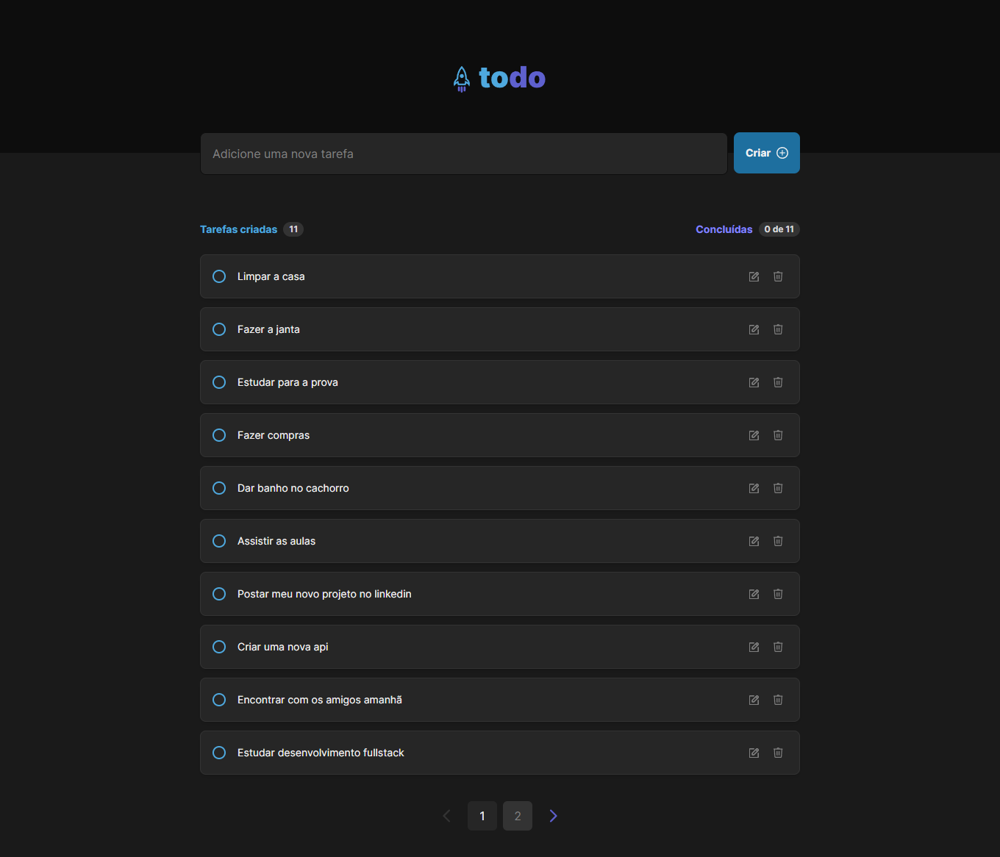

# Frontend da aplicação To Do List

<div display="flex">
  
  
  
  
  
  
  
</div>




## Sumário

- [Introdução](#introdução)
- [Instalação e execução](#instalação-e-execução)
- [Execução local junto com o backend](#execução-local-junto-com-o-backend)
- [Visão geral](#visão-geral)
- [Tecnologias utilizadas](#tecnologias-utilizadas)
- [Design](#design)
- [Autor e Licença](#autor-e-licença)

## Introdução

To-Do List é uma aplicação web que permite ao usuário criar, editar e excluir tarefas. O projeto foi desenvolvido com React, Redux e TypeScript, e utiliza a [API](https://to-do-list-api-6u0s.onrender.com) hospedada, que foi criada na pasta `backend` para realizar as operações de CRUD.

## Instalação e execução
#### Para instalar e executar o projeto, siga os passos abaixo:

1. Clone o repositório
- Abra o terminal e execute o comando abaixo para clonar o repositório:

  ```bash
    git clone https://github.com/luizfelipe9627/to-do-list-fullstack.git
  ```

2. Acesse a pasta do projeto
- Navegue até a pasta do projeto com o comando abaixo:

  ```bash
    cd to-do-list-fullstack/frontend
  ```

3. Instale o Docker
- Para instalar o Docker, siga as instruções no link abaixo:

  ```bash
    https://docs.docker.com/get-docker/
  ```

5. Inicie a Image e o Container do Docker
- Execute o comando abaixo para iniciar a aplicação:

  ```bash
    npm run docker:web
  ```

6. Acesse a aplicação

- Abra o navegador e acesse o endereço abaixo:

  ```bash
    http://localhost:3000
  ```


## Execução local junto com o backend

1. Primeiro execute a aplicação ao frontend caso ainda não tenha feito isso, siga as instruções acima.

2. Para executar a aplicação em conjunto com o backend, siga as instruções do arquivo [README.md](../backend/README.md) na pasta `backend`, te ensinando a iniciar o backend junto com o banco de dados.

3. Defina a variável de ambiente `REACT_ENV` no arquivo `.env` na raiz do projeto frontend.
  
  - Coloque o valor `development` para executar a aplicação em conjunto com o backend localmente:
    ```bash
      REACT_ENV=development
    ```

  - Coloque o valor `production` para executar a aplicação em conjunto com o backend hospedado(talvez fique lento devido a hospedagem gratuita):
    ```bash
      REACT_ENV=production
    ``` 

4. Acessar a aplicação
- Abra o navegador e acesse o endereço abaixo:

  ```bash
    http://localhost:3000
  ```

## Visão geral
A aplicação é composta por uma tela inicial, onde o usuário pode visualizar todas as tarefas cadastradas, e uma tela de criação de tarefas, onde o usuário pode adicionar uma nova tarefa, editar ou excluir uma tarefa existente. A aplicação possui um layout responsivo e é possível visualizá-la em dispositivos móveis.

## Tecnoogias utilizadas

- [React](https://reactjs.org/): Biblioteca JavaScript para criar interfaces de usuário.
- [Redux Toolkit](https://redux-toolkit.js.org/): Biblioteca para gerenciamento de estado da aplicação.
- [Tailwind CSS](https://tailwindcss.com/): Framework CSS para estilização de componentes.
- [Vite](https://vitejs.dev/): Build tool para aplicações web.
- [EsLint](https://eslint.org/): Ferramenta de análise de código estática para identificar e corrigir problemas no código JavaScript.

## Desing

O design da aplicação foi criado no [Figma](https://www.figma.com) e está disponível no link abaixo:

- [Design da aplicação](https://www.figma.com/community/file/1175262836322989600/todo-list?searchSessionId=lv8qf378-5fiy3dbkoce)

## Autor e Licença

Este projeto foi desenvolvido por [Luiz Felipe Silva](https://github.com/luizfelipe9627) e está sob a licença MIT. Veja o arquivo [LICENSE](./LICENSE) para mais detalhes.
